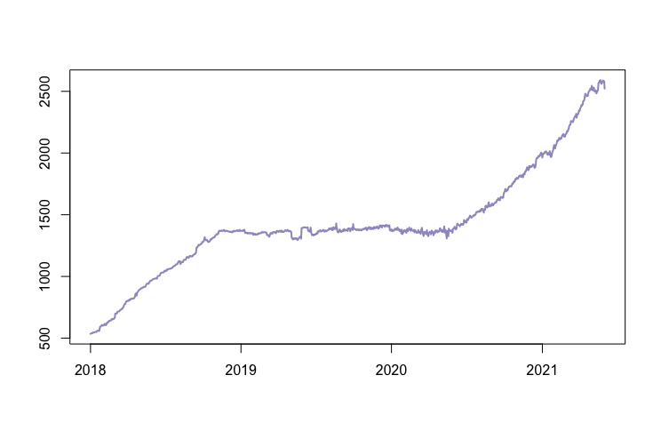
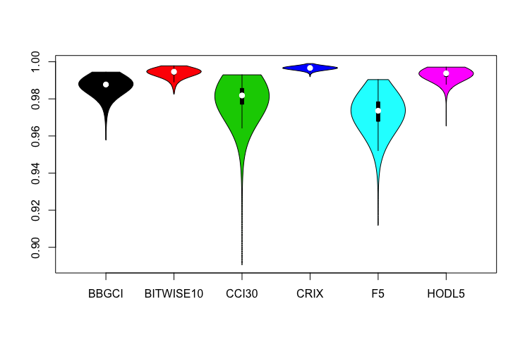
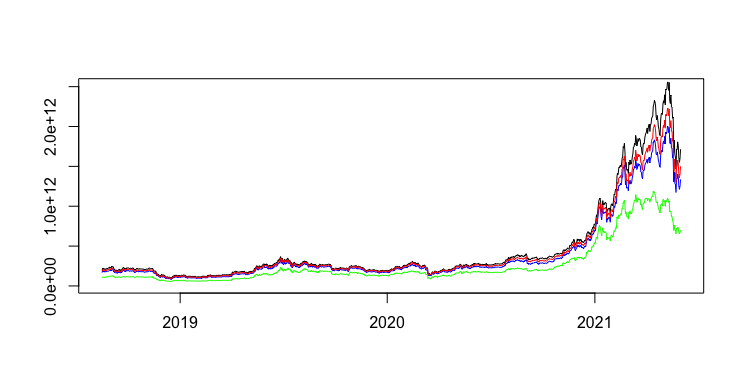
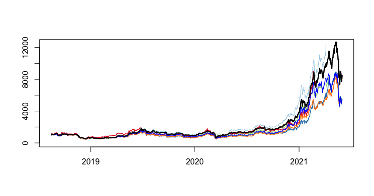
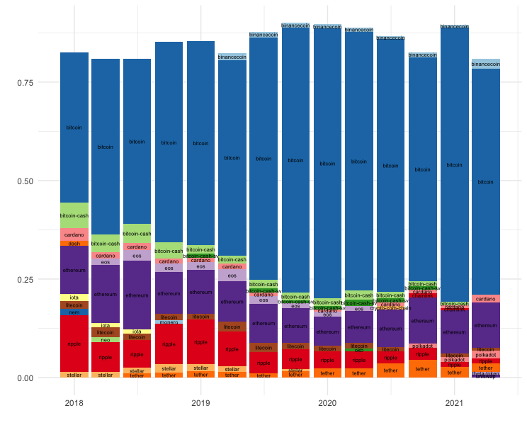

[](http://quantlet.de/)

## [](http://quantlet.de/) **evaluation_indices** [](http://quantlet.de/)

```yaml

Name of Quantlet: 'evaluation_indices'

Published in: 'Indices on Cryptocurrencies an Evaluation'

Description: 'This Quantlet provides the code for the paper "Indices on Cryptocurrencies An Evaluation". It allows to visualize the indices under review, to compute higher moments and to compute several comparison measures.'

Keywords: 'Cryptocurrency, Index, CRIX, Market Dynamics, Probabilistic Sharpe Ratio' 

Author: 'Konstantin Häusler, Hongyu Xia'

Datafile: 'data from CoinGecko on all available cryptocurrencies that has been used in this analysis can be found here: https://box.hu-berlin.de/d/f498df3c88184bec8d68/ '

```











### R Code
```r

#########################################################
##### Indices on CCs - an Evaluation ####################
#########################################################

#authors: Konstantin Häusler, Hongyu Xia

#load packages
library(PMwR)
library(dplyr)
library(lubridate)
library(zoo)
library(quantmod)
library(moments)
library(corrplot)
library(xtable)
library(vioplot)
library(ggplot2)
library(viridis)
library(RColorBrewer)
display.brewer.all()
colors <- brewer.pal(10, "Paired")

# set working directory
setwd("your directory")

#load cryptocurrency (CC) data (source: CoinGecko)
#2018-2020
CCs <- read.csv("test.csv")
#2021
CCs21 <- read.csv("20210605_test.csv")

#cleaning
CCs$Datetime <- as.Date(CCs$Datetime,  format="%Y-%m-%d")
CCs21$Datetime <- as.Date(CCs21$Datetime, format="%Y-%m-%d")
CCs21 <- CCs21[CCs21$Datetime > "2020-12-31",]

#merge datasets
CCs <- rbind(CCs,CCs21)

remove_empty_rows <- function(x){
  #x <- x[x$prices >0 & x$total_volumes >0 & x$market_caps >0,] 
  x <- x[ x$market_caps >0,] 
  x
}
CCs <- remove_empty_rows(CCs)

####################################
##### Plot: # of active CCs ########
####################################

number_active_coins <- function(x){
  w <- NULL
  for (i in levels(factor(x$Datetime))) {
    tmp.w <- nrow(x[x$Datetime == as.character(i),])
    w <- rbind(w, tmp.w)
  }
  w
}

w <- number_active_coins(CCs)
w <- as.data.frame(w)
rownames(w) <- levels(factor(CCs$Datetime))
colnames(w) <- "number_of_coins"
w$Date <- levels(factor(CCs$Datetime))
w$Date <- as.Date(w$Date)

par(bg=NA)
plot(w$number_of_coins~w$Date, type = "l" , ylab = "", xlab= "", 
     lwd=2,
     col="#9E9AC8")

#########################################################
##### Total Market Index ################################
#########################################################

#calculate daily market cap (sum of market cap of all coins)
TMI <- aggregate(CCs$market_caps, by = list(CCs$Datetime), FUN = sum)
TMI$Group.1 <- as.Date(TMI$Group.1)
names(TMI) <- c("date", "TMI")

#TMI.201808<- TMI[TMI$date > "2018-08-18",]


#########################################################
############ CC Indices #################################
#########################################################

#read index data
several <- read.csv("20210602_index_data.csv",
                    sep=";")
bbgci <- several[,1:2]
bbgci$X <- as.Date(bbgci$X, format="%d/%m/%Y")
bbgci$BGCI <- as.numeric(gsub(",",".",bbgci$BGCI))
names(bbgci) <- c("Date", "BBGCI")

bitwise10 <- several[,3:4]
bitwise10$X.1 <- as.Date(bitwise10$X.1, format="%d/%m/%Y")
bitwise10$Bitwise.10 <- as.numeric(gsub(",",".",bitwise10$Bitwise.10))
names(bitwise10) <- c("Date", "BITWISE10")

hodl5 <- several[, 5:6]
hodl5$X.2 <- as.Date(hodl5$X.2, format="%d/%m/%Y")
hodl5$HODL5 <- as.numeric(gsub(",",".",hodl5$HODL5))
names(hodl5) <- c("Date", "HODL5")

nci <- several[,7:8]
nci$X.3 <- as.Date(nci$X.3, format="%d/%m/%Y")
nci$NCI <- as.numeric(gsub(",",".",nci$NCI))
names(nci) <- c("Date", "NCI")

cci30 <- read.csv("20210603_cci30.csv")
cci30 <- cci30[,c("Date", "Close")]
cci30$Date <- as.Date(cci30$Date, format="%Y-%m-%d")
cci30$Close <- as.numeric(as.character(cci30$Close))
names(cci30) <- c("Date", "CCI30")
cci30 <- cci30[order(cci30$Date),]

crix <- read.csv("http://data.thecrix.de/data/crix.csv", header=TRUE)
names(crix) <- c("Date", "CRIX")
crix$Date <- as.Date(crix$Date)

f5 <- read.csv2("/Users/konstantin/Desktop/dateien/IRTG 1792/CoinGecko/updated index data/F5.csv")
f5$Date <- as.Date(f5$Date, format="%Y-%m-%d")
f5$F5.Crypto.Index <- as.numeric(as.character(f5$F5.Crypto.Index))
names(f5) <- c("Date", "F5")

#merge datasets
index.data <- merge(TMI, bbgci, by.x = "date", by.y = "Date", all.x = T)
index.data$BBGCI <- na.locf(index.data$BBGCI, na.rm = F)
index.data <- merge(index.data, bitwise10, by.x = "date", by.y = "Date", all.x = T)
index.data$BITWISE10 <- (na.locf(index.data$BITWISE10) + rev(na.locf(rev(index.data$BITWISE10))))/2
index.data <- merge(index.data, cci30, by.x = "date", by.y = "Date", all.x = T)
index.data <- merge(index.data, crix, by.x = "date", by.y = "Date", all.x = T)
index.data <- merge(index.data, f5, by.x = "date", by.y = "Date", all.x = T) #2018-08-15
index.data <- merge(index.data, hodl5, by.x = "date", by.y = "Date", all.x = T)
index.data <- index.data[index.data$date >"2018-08-14",]
#names(index.data)[2] <- "TMI"
#index.data <- index.data[complete.cases(index.data),]

#norm indices
index.i <- names(index.data)[-1]
for (i in index.i) {
  index.data[, paste(i, "_normed", sep = "")] <-index.data[, i] / index.data[1,i] *1000
}

##################################################
###descriptive statistics and Sharpe ratios#######
##################################################

#compute returns
for (i in index.i) {
  index.data[, paste(i, "_return", sep ="")] <- Delt(index.data[,i])
}

#moments
avg_returns <- apply(index.data[,paste(index.i, "_return", sep = "")], 2, FUN = function(x){mean(x, na.rm = T)})
avg_returns.p <- avg_returns * 100
standarddeviation_returns <- apply(index.data[,paste(index.i, "_return", sep = "")], 2, FUN = function(x){sd(x, na.rm = T)})
skewness <- apply(index.data[,paste(index.i, "_return", sep = "")], 2, FUN = function(x){skewness(x, na.rm = T)})
kurtosis <- apply(index.data[,paste(index.i, "_return", sep = "")], 2, FUN = function(x){kurtosis(x, na.rm = T)})
sharpe_ratios <- avg_returns / standarddeviation_returns

#PSR
psr <- NULL
for (i in seq(1:length(index.i)) ) {
  input <- (sharpe_ratios[[i]] * sqrt(length(index.data$date) -1)) / sqrt(1-skewness[[i]] * sharpe_ratios[[i]] + ((kurtosis[[i]] -1)/4)*sharpe_ratios[[i]]^2)
  tmp <- pnorm(input)
  print(tmp)
  psr <- rbind(psr, tmp)
}

#max drawdown
max_drawdown<-function(x){
  dd<-drawdowns(x) 
  dd <- dd[order(dd$max, decreasing = TRUE), ]
  dd$duration<-dd$trough-dd$peak
  return(dd[1,])
}
maxdrawdown<-data.frame()
for (i in seq(1:length(index.i)) ) {
  index<- zoo(index.data[,paste(index.i[i], "_normed", sep = "")], as.Date(index.data$date))
  a<-data.frame(max_drawdown(index))
  a$index<-index.i[i]
  maxdrawdown<-rbind(maxdrawdown,a)
}

output <- data.frame(returns = avg_returns.p, 
                     sd = standarddeviation_returns,
                     skewness = skewness,
                     kurtosis = kurtosis,
                     sharpe_ratio = sharpe_ratios, 
                     PSR = psr,
                     MMD = maxdrawdown$max,
                     row.names = index.i)
xtable(output, digits = 3)


##############################
###Visualization of Indices###
##############################

#remove outlier
index.data <- index.data[-which(index.data$date=="2021-03-25"),]

dev.off()
par(bg=NA)
plot(index.data$TMI_normed ~index.data$date,  type ="l", ylim = c(0, 12500), xlab="", 
     ylab="", lwd = 2, lty = 1)
lines(index.data[,"CRIX_normed"] ~ index.data$date, type = "l",pch=3, lty=1, lwd=1, col= "#A6CEE3") #pch=3, colors[1]
lines(index.data[,"BITWISE10_normed"] ~ index.data$date, type="l", col= colors[3], lwd=1.5, lty=1) #15 #B2DF8A
lines(index.data[,"CCI30_normed"] ~ index.data$date, type="l", col= "#1F78B4", lwd=1.5, lty=1)  #, pch=4 colors[2]              #19
lines(index.data[,"F5_normed"] ~ index.data$date, type="l", col= "#E31A1C", lwd=1.5, lty=1)  #, pch=8  colors[6]             #23
lines(index.data[,"BBGCI_normed"] ~ index.data$date, type="l", col= "#FF7F00", lwd=1.5, lty=1)    #25 colors[8]
lines(index.data[,"HODL5_normed"] ~ index.data$date, type="l", col= "blue", lwd=1.5, lty=1) 
lines(index.data$TMI_normed ~index.data$date,  type ="l", ylim = c(0, 2000), xlab="", 
      ylab="", lwd = 2, lty = 1)


##############################
#Corrletation Indices & TMI###
##############################

# Creating Function to obtain Correlations between each Index and the TMI
corr_tmi_to_index <- function(sel.index, sample.i) {
  dt <- index.data[sample.i,c(sel.index,"TMI" )] 
  fit.cor <- cor(dt[,sel.index], dt[,"TMI"], use="complete.obs")
  return(fit.cor)
} 
corr_tmi_to_index(sel.index = "CRIX", sample.i= c(1:100))

#now with random draws
cor.vec.matrix <- data.frame()
for (j in index.i) {
  for (i in c(1:1000)) {
    ind <- sample(c(1:nrow(index.data)), 100)
    tmp.cor <- corr_tmi_to_index(sel.index = j, sample.i=ind)
    cor.vec.matrix[i,j] <- tmp.cor
  }
}

# violinplot
par(bg=NA)
vioplot(cor.vec.matrix[2:length(names(cor.vec.matrix))], col=1:length(names(cor.vec.matrix)))
# , col = 2:6, border = 2:6

#############################################
### representation of CC sector##############
#############################################

#market cap of Bitcoin
bitcoin <- data.frame(date = CCs$Datetime[CCs$Id=="bitcoin"], MC.bitcoin = CCs$market_caps[CCs$Id=="bitcoin"])
CCs$market_caps[CCs$Id=="bitcoin", c("Datetime")]

#market cap of top 10 CCs
top10 <- aggregate(CCs$market_caps, by= list(CCs$Datetime), FUN = function(x){sum(sort(x, decreasing = TRUE)[1:10])})
names(top10) <- c("Date", "Top10_MC")

#market cap of top 30 CCs
top30 <- aggregate(CCs$market_caps, by= list(CCs$Datetime), FUN = function(x){sum(sort(x, decreasing = TRUE)[1:30])})
names(top30) <- c("Date", "Top30_MC")

cc.rep <- data.frame(date=TMI$date, 
                     Bitcoin = bitcoin$MC.bitcoin,
                     TMI = TMI$TMI,
                     top10 = top10$Top10_MC, 
                     top30 = top30$Top30_MC)

#plot
plot(TMI~date, data= cc.rep[cc.rep$date>"2018-08-15",], type="l",  ylim=c(1e+10, 25e+11), xlab="", ylab="")
lines(top10~date, data= cc.rep[cc.rep$date>"2018-08-15",], type="l", col="blue")
lines(top30~date, data= cc.rep[cc.rep$date>"2018-08-15",], type="l", col="red")
lines(Bitcoin~date, data= cc.rep[cc.rep$date>"2018-08-15",], type="l", col="green")

################################################
## CC sector is under constant transformation###
################################################
#  i) composition of top 10 coins is steadily changing
#  ii) market share of top 10 coins is not 100%

shares <- CCs

#compute market share of each CC
shares$Datetime <- as.Date(shares$Datetime, format="%Y-%m-%d")
shares <- merge(shares, TMI, by.x="Datetime",by.y = "date", all.x=T )
shares$weight <- shares$market_caps / shares$TMI
weight.dates <- seq(as.Date("2018-01-01"), as.Date("2021-06-01"), by="3 mon")
shares <- shares[shares$Datetime %in% weight.dates,]

#select top 10 CCs for each date
shares.plot <- data.frame()
for (date in unique(shares$Datetime)) {
  shares.tmp <- shares[shares$Datetime == date,]
  shares.tmp <- shares.tmp[order(-shares.tmp$weight),][1:10,]
  #print(shares.tmp)
  shares.plot <- rbind(shares.plot, shares.tmp)
}
shares.plot$Id <- factor(shares.plot$Id)

#plot
ggplot(shares.plot, aes(fill=Id, y=weight, x=Datetime)) + 
  geom_col(aes(fill = Id)) +
  #scale_color_viridis(discrete=F, option="magma")+
  #scale_fill_viridis(discrete = T, option="magma") +
  #scale_fill_brewer(palette = "Spectral")+
  scale_fill_manual(values=rep(brewer.pal(12,"Paired"),times=2))+
  geom_text(aes(label = Id), position = position_stack(vjust = 0.5), size=2)+
  theme_minimal()+
  theme(legend.position = "none")+
  xlab("") + ylab("")


```

automatically created on 2021-06-08